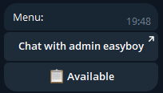
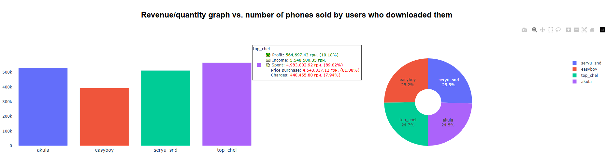

<table align="center">
  <tr>
    <td align="center">
        
    </td>
    <td align="center">
      
    </td>
    <td align="center">
      
    </td>
    <td align="center">
      
    </td>
    <td align="center">
      
    </td>
  </tr>
  <tr>
  <td colspan="5" align="center">
    <table>
      <tr>
        <td align="center">
          
        </td>
        <td align="center">
          
        </td>
        <td align="center">
          
        </td>
      </tr>
    </table>
  </td>
</tr>
  <tr>
    <td colspan="5" align="center">
      
    </td>
  </tr>
</table>

---

## Table of Contents

- [Introduction](#introduction)
- [Screenshots](#screenshots)
  - [Menu panels by role](#menu-panels-by-role)
  - [Example of phones menu](#example-of-phones-menu)
  - [Phone menu for admin](#phone-menu-for-admin)
  - [Statistic by Plotly](#statistic-by-plotly)
    - [Statistic menu and summary statistic](#statistic-menu-and-summary-statistic)
    - [Chart of profit relative to phones sold](#chart-of-profit-relative-to-phones-sold)
    - [Profit/quantity graph relative to models sold](#profitquantity-graph-relative-to-models-sold)
    - [Profit/quantity graph relative to corrected defects of sold models](#profitquantity-graph-relative-to-corrected-defects-of-sold-models)
    - [Revenue/quantity graph vs number of phone sold by users who downloaded them](#revenuequantity-graph-vs-number-of-phone-sold-by-users-who-downloaded-them)
- [To start the project](#to-start-the-project)

# Introduction

This project is a commercial CRM system implemented as a Telegram Bot, designed to streamline the management of processes involved in buying used phones, repairing them, and selling them. The system leverages auto-generated statistics with interactive diagrams powered by [Plotly](https://plotly.com/) for enhanced data visualization.

The project was created when I started learning Python. It uses plain SQL as well, without an ORM.

# Screenshots
## Menu panels by role
<table>
  <tr>
    <td align="center">
      
      <p>User panel</p>
    </td>
    <td align="center">
      
      <p>Courier panel</p>
    </td>
    <td align="center">
      
      <p>Manager panel</p>
    </td>
    <td align="center">
      
      <p>Admin panel</p>
    </td>
  </tr>
</table>

## Example of phones menu
<div align="center">
  
</div>

## Phone menu for admin
<div align="center">
  
</div>

## Statistic by [Plotly](https://plotly.com/)
### Statistic menu and summary statistic
<div align="center">
  
</div>

### Chart of profit relative to phones sold
<div align="center">
  
</div>

### Profit/quantity graph relative to models sold
<div align="center">
  
</div>

### Profit/quantity graph relative to corrected defects of sold models
<div align="center">
  
</div>

### Revenue/quantity graph vs number of phone sold by users who downloaded them
<div align="center">
  
</div>

# To start the project
1. **Rename** `.env example` to `.env` and set your variables.
2. **Install dependencies** (if not yet):
   ```sh
   pip install -r requirements.txt
   ```
3. **Run the bot:**
   ```sh
   python main.py
   ```